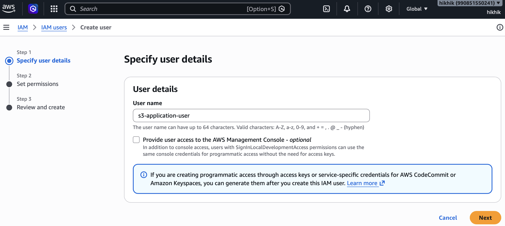
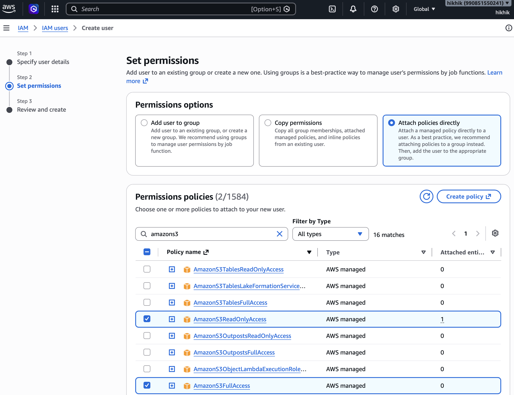

# Quick Start for Amazon S3 and IAM

To create Amazon S3 access credentials, you must create an Identity and Access Management (IAM) user, grant it S3 permissions, and then generate the access keys. Never create access keys for your primary root account, as doing so poses severe security risks.

## 1 - Create an S3 bucket

1. Log in to the [AWS Management Console](console.aws.amazon.com)
2. Navigate to **S3**
3. Click on **Create bucket**
   - **Bucket type:** General purpose
   - **Bucket namespace:** Account Regional namespace (recommended)
   - **Bucket name prefix:** tableflow-data (for example)
   - **Object Ownership:** ACLs disabled (recommended)
4. Note the full name of the bucket created.

## 2 - Create an IAM User

1. Log in to the [AWS Management Console](console.aws.amazon.com)
2. Search for and select IAM (Identity and Access Management).
3. In the left navigation pane, click **IAM Users** and then select **Create user**.
4. Enter a descriptive username (e.g., s3-application-user).
5. Leave the "Provide user access to the AWS Management Console" option unchecked since this user only needs programmatic API access.
6. Click **Next**.

## 3 - Grant S3 Permissions

1. On the permissions page, select **Attach policies directly**.
2. In the Permissions policies, search for **S3**.
3. Check the box next to the policy that matches your needs:
    - AmazonS3FullAccess: Allows creating, viewing, deleting, and modifying any bucket.
    - AmazonS3ReadOnlyAccess: Allows viewing and downloading files only.
4. Click **Next**.
5. Review the user configuration, and click **Create user**.

## 4 - Generate the Access Key and Secret Key

1. From the Users list, click on the name of the user you just created.
2. Navigate to the **Security credentials** tab.
3. Scroll down to the **Access keys** section and click **Create access key**.
4. Choose **Application running outside AWS** as your usecase.
5. Click **Next**.
6. (Optional) Add a description tag to remind you what application uses this key.
7. Click Create access key.
8. Download or copy the **Access Key** and **Secret Access Key**.
