# Real-Time Banking Analytics — Flink + AstraDB

This document covers everything needed to run the analytics pipeline: dimension loading, Flink SQL job deployment, sink workers, and querying the AstraDB analytics tables.

---

## Prerequisites

- Python >=3.10 with the project venv already set up (`./scripts/setup.sh`)
- `.env` file populated (see [Environment Variables](#environment-variables))
- AstraDB:
  - Database available
  - Application token available
  - Secure Connect Bundle downloaded
- Confluent Cloud: (`README_confluent_cloud.md`)
  - Account and Cluster available
  - API keys generated
  - `banking.transactions` topic exists
  - Flink environment provisioned (Confluent Cloud Console → Environments → Flink)
- AWS (`README_amazon_s3.md`)
  - S3 bucket exists
  - Access policy and access keys exist
- Banking Data: (`README_dataset_generator.md`)
  - dimension data generated
  - transactions generating and streaming

---

## Environment Variables

Copy `.env.example` to `.env` and fill in every value:

| Variable | Description |
|---|---|
| `ASTRA_DB_APPLICATION_TOKEN` | AstraDB application token (`AstraCS:...`) |
| `ASTRA_SECURE_BUNDLE_PATH` | Absolute path to Astra DB Secure Connect Bundle (`secure-connect-<db>.zip`) |
| `ASTRA_KEYSPACE` | Astra DB Target keyspace |
| `KAFKA_BOOTSTRAP_SERVERS` | Confluent Cloud REST bootstrap server (`host:port`) |
| `KAFKA_API_KEY` | Confluent Cloud REST API key |
| `KAFKA_API_SECRET` | Confluent Cloud REST API secret |
| `KAFKA_TOPIC` | Confluent Cloud transaction topic (default: `banking.transactions`) |
| `TABLEFLOW_ENDPOINT` | Confluent Cloud Tableflow API endpoint |
| `TABLEFLOW_API_KEY` | Confluent Cloud Tableflow API key |
| `TABLEFLOW_API_SECRET` | Confluent Cloud Tableflow API secret |
| `SCHEMA_REGISTRY_URL` | Confluent Cloud Schema Registry API endpoint |
| `SCHEMA_REGISTRY_API_KEY` | Confluent Cloud Schema Registry API key |
| `SCHEMA_REGISTRY_API_SECRET` | Confluent Cloud Schema Registry API secret |
| `AWS_ACCESS_KEY_ID` | Amazon S3 Access key |
| `AWS_SECRET_ACCESS_KEY` | Amazon S3 Secret Access key |

---

## Step 1 — Define Flink watermark on banking.transactions

### Via Confluent Cloud Console (UI)

1. Open **Confluent Cloud Console → SQL Workspaces**.
2. Click on **Create new workspace**.
3. Paste the SQL statement.
4. Click **Run**.

```sql
ALTER TABLE `banking.transactions` 
MODIFY WATERMARK FOR txn_time AS txn_time - INTERVAL '5' SECOND;
```

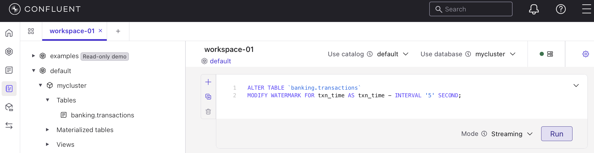

---

## Step 2 — Create Kafka Topics

Create the dimension topics in Confluent Cloud before running anything.

**Dimension topics** (compacted, used by Flink lookup joins):

```txt
banking.dimensions.account
banking.dimensions.branch
banking.dimensions.customer
banking.dimensions.employee
```

> **Note:** *In Advanced Settings, set the dimension topics to `cleanup.policy=compact` so Flink always has the latest value for each key.*


---

## Step 3 — Load Dimensions into Kafka

Run once (or whenever dimension data changes materially):

```bash
# Activate virtual environemnt
source .venv/bin/activate

# Dry run — print record counts only, write nothing
python src/dimension_loader.py
```

This script:

1. Connects to AstraDB ODS and reads all rows from `account`, `branch`, `customer`, `employee`.
2. Publishes each row as an AVRO message to the corresponding `banking.dimensions.*` topic, keyed by the primary key UUID.

Re-run this script after bulk dimension changes (e.g. new branch added, customer data refresh). Individual real-time changes should be published directly to the dimension topics by the upstream system.

---

## Step 4 — Deploy Flink Materialized Tables

We use Confluent Flink materialized tables instead of the older manual process of separately creating each of the workflow elements.

- Combines the table definition and the continuous background query into one manageable entity.
- Automatically spins up the backing Kafka topic and registers schemas in the Schema Registry.
 
Each SQL file in `src/flink/` is a self-contained Flink SQL statement. Deploy them all to Confluent Cloud Flink.

### Via Confluent Cloud Console (UI)

1. Open **Confluent Cloud Console → SQL Workspaces**.
2. Click **+ New statement**.
3. Paste the contents of the SQL file.
4. Click **Run**. The job runs and creates the materialized table.
5. Repeat for each of the SQL files.


### Job summary

| File | Input | Joins | Output topic |
|---|---|---|---|
| [`q1_txn_by_account.sql`](flink/q1_txn_by_account.sql) | `banking.transactions` | none | `analytics.transactions_by_account` |
| [`q2_high_value_hourly.sql`](flink/q2_high_value_hourly.sql) | `banking.transactions` | none | `analytics.high_value_transaction_hourly` |
| [`q3_high_value_by_city.sql`](flink/q3_high_value_by_city.sql) | `banking.transactions` | account → branch | `analytics.high_value_transaction_by_city` |
| [`q4_withdrawal_by_employee.sql`](flink/q4_withdrawal_by_employee.sql) | `banking.transactions` | employee → branch | `analytics.withdrawal_transaction_by_employee` |
| [`q5a_customer_account_count.sql`](flink/q5a_customer_account_count.sql) | `banking.transactions` | none | `analytics.customer_account_count` |
| [`q5b_customer_quarterly.sql`](flink/q5b_customer_quarterly.sql) | `banking.transactions` | account | `analytics.customer_quarterly_summary` |
| [`q6_branch_daily_rollup.sql`](flink/q6_branch_daily_rollup.sql) | `banking.transactions` | account | `analytics.branch_daily_rollup` |

---

## Step 5 — Confluent Tableflow + Zero-Copy Data Federation

The easiest way to integrate WatsonX.Data and Confluent is through Confluent Tableflow. Tableflow automatically materializes Kafka topics into Iceberg open-table formats residing in your cloud storage or in Confluent storage. For this solution we will use Amazon S3.

### 5.1 - Enable Tableflow in Confluent Cloud

Configure Confluent Cloud to automatically materialize your streaming Kafka topics into Iceberg open-table formats. Confluent currently supports AWS, GCP, Microsft Azure. In our case, we will be using Amazon S3 with IAM AssumeRole.

This will require working in both the AWS Console and the Confluent Cloud Console

#### 5.1.1 - Add an S3 Provider Integration

1. Navigate to **Integrations** within your environment in **Confluent Cloud Console**.
2. Click **Add Integration**
3. Add integration details: Select **AWS IAM role**
4. Configure role in AWS: Select **New role**
5. Create permission policy in AWS:
   This IAM policy will grant Confluent access to your Amazon S3 bucket.
    - Navigate to **IAM Policies** in your **AWS Console**
    - Click **Create policy**
    - Select **Policy Editor JSON**
    - Edit the file `AWS_IAM_policy.json`, replace \<bucket-name\> with the full name of the bucket you created earlier.
    - Paste this policy into the policy editor in the AWS console.
    - Click **Next**.
    - Provide a name for this policy.
    - Click **Create policy**.

    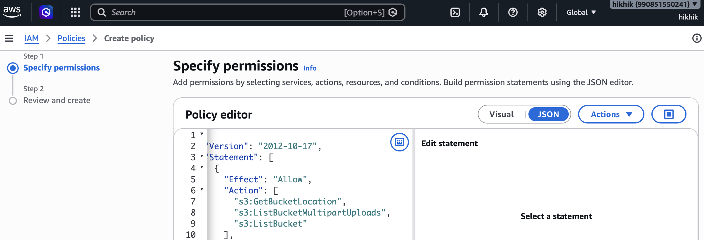

6. Back in **Confluent Cloud Console**:
    - click **Continue**
7. Create a new role in AWS:
   The above policy will be associated with this role.
    - Navigate to **IAM Roles** in your **AWS Console**
    - Click **Create role**
    - For the Trusted entity type, select **Custom trust policy**
    - Copy the policy from `AWS_IAM_role.json`.
    - Paste this policy into the Custom trust policy editor in the AWS console.
    - Click **Next**.

      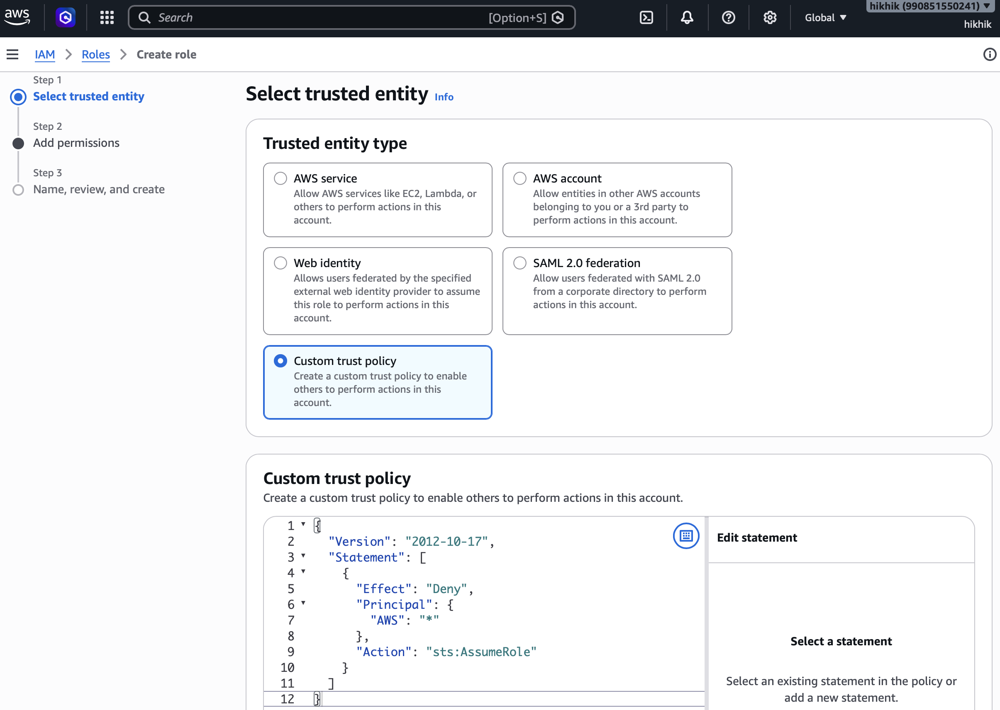

    - For Add Permissions, select the IAM Policy that you created earlier.
    - Click **Next**.
    - Provide a name for this role.
    - Click **Create role**.
    - Once the role is created, copy the ARN from the Summary section of your AWS role page

      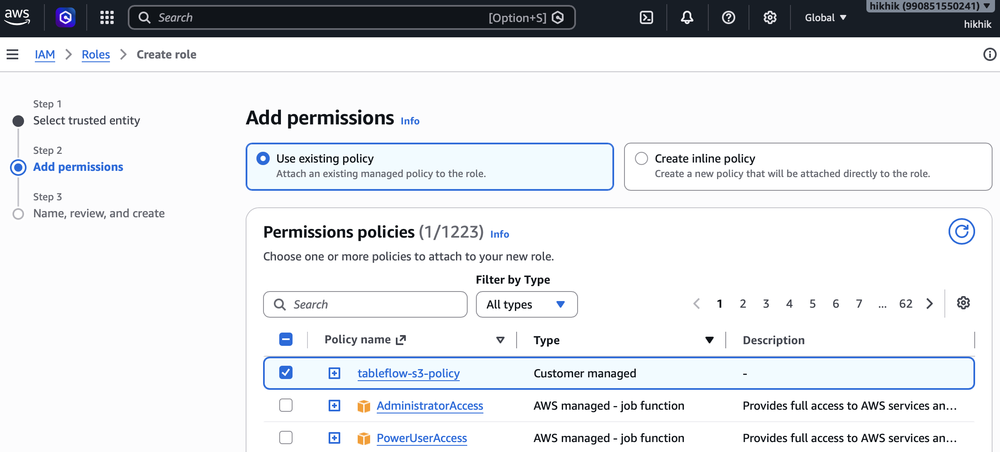

8. Map the role in Confluent:
    - Back in **Confluent Cloud Console**:
      - paste the ARN that you just create for the AWS role.
      - provide a name for this integration.
      - Click **Continue**.

        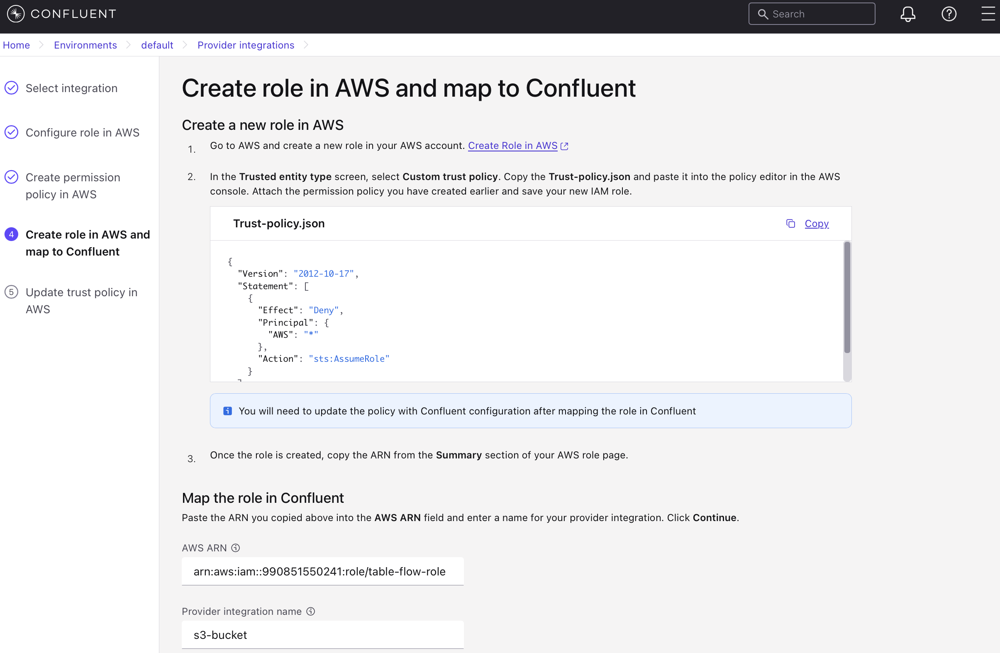

9. Update the role trust policy in AWS
    - Navigate to **IAM Role** just created in your **AWS Console**.
    - Select the **Trust relationships** tab
    - Click **Edit trust policy**
    - Replace the policy with the new policy generated from Confluent.
    - Click **Update policy**
10. Back in **Confluent Cloud Console**:
    - click **Continue**

#### 5.1.3 - Activate TableFlow

1. Navigate to Topics in **Confluent Cloud Console**.
2. Click on **Enable Tableflow** for each of the *analytics* topics.

    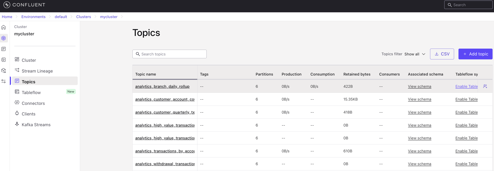

3. Enable Tableflow

    - Choose **Iceberg** as your table format.
    - Click **Configure custom storage**.

      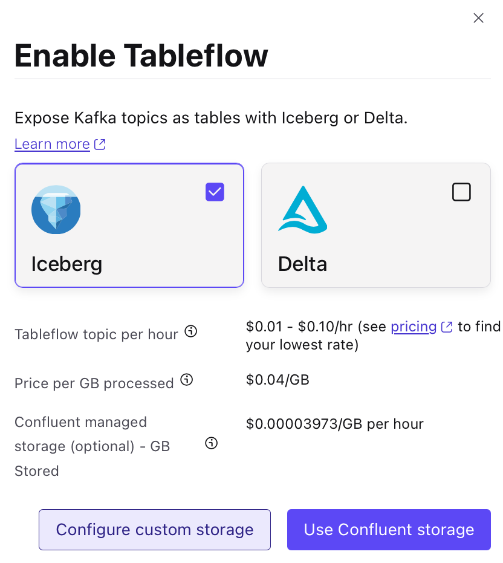


4. Choose where to store your Tableflow data

    - Select **Store in your own storage**.
    - Select the AWS Provider Integration that you created earlier.
    - Enter the Amazon S3 bucket name that you created earlier.
    - Click **Continue**

      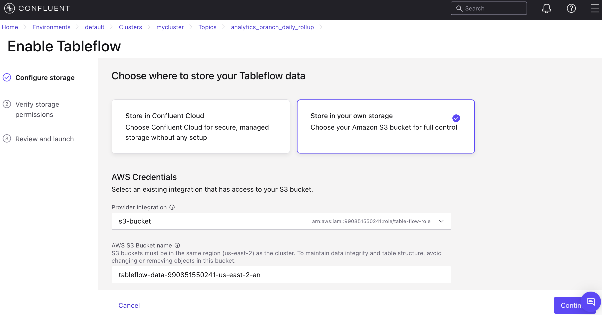

5. Verify Storage Permissions:

    - You **MUST** click on the **AWS IAM Console** link (in order to atcivate the check box below)
    - Check the **I’ve confirmed my IAM role has this permission policy** box
    - Click **Continue**

6. Click **Launch**

7. Repeat this process for each of the *analytics* topics (topics starting with *analytics*).

### 5.2 - Register the Confluent Catalog in IBM watsonx.data

Configure watsonx.data environment to look across to Confluent as a external data platform without actually duplicating or importing the storage footprint.

1. Navigate to the Infrastructure manager tab in your IBM watsonx.data instance console.
2. Click Add Component and select **Custom** from Data Sources.

    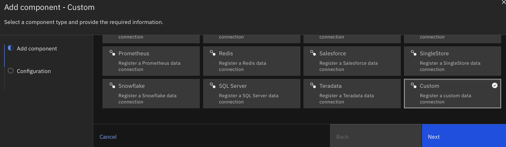

3. Enter a display name (e.g., confluent_tableflow).
4. In the Properties section, add the following properties:

    ```conf
    connector.name=iceberg
    iceberg.catalog.type=REST
    iceberg.rest.uri={TABLEFLOW_ENDPOINT}
    iceberg.rest.auth.type=OAUTH2
    iceberg.rest.auth.oauth2.credential={APIKEY}:{SECRET}
    hive.s3.aws-access-key={S3_ACCESS_KEY}
    hive.s3.aws-secret-key={S3_SECRET_KEY}
    ```

  - Replace the placeholders:

    - {TABLEFLOW_ENDPOINT}: Your Confluent Tableflow Iceberg REST Catalog Endpoint
    - {APIKEY}:{SECRET}: Your Confluent Tableflow API credentials
    - {S3_ACCESS_KEY}, {S3_SECRET_KEY}: Your S3 access credentials

5. Tick the **Associate catalog** checkbox, and enter a catalog name (e.g. confluent_tableflow_catalog).
6. Click **Create**.

    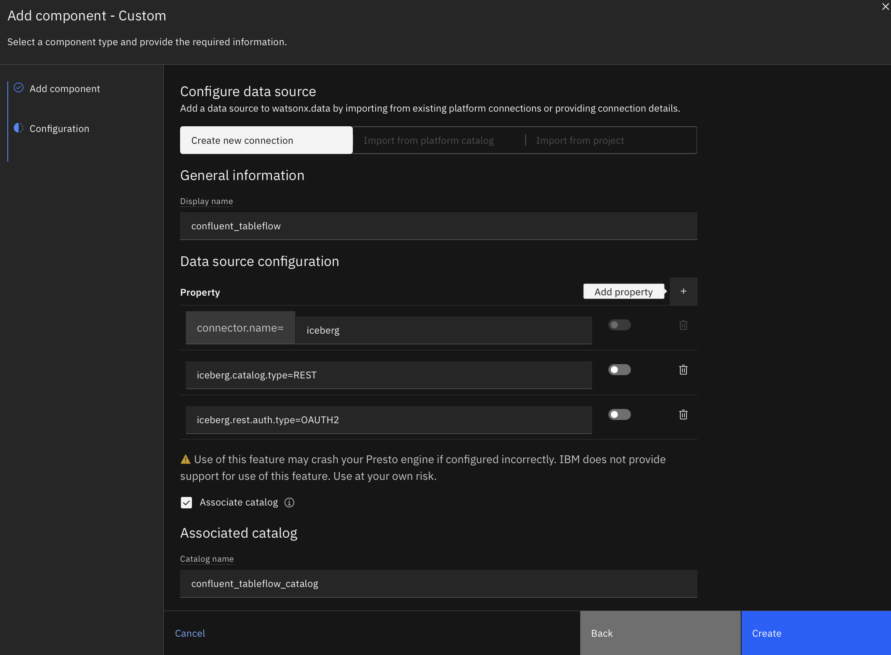

### 5.3 - Associate the Catalog with Your Engines

To run SQL queries against your real-time Confluent tables, your query engines need access permissions to this new catalog metadata.

1. In the Infrastructure manager, locate your newly created confluent_tableflow_catalog catalog.
2. Click the **Manage associations** button that appears when you hover over the catalog.

    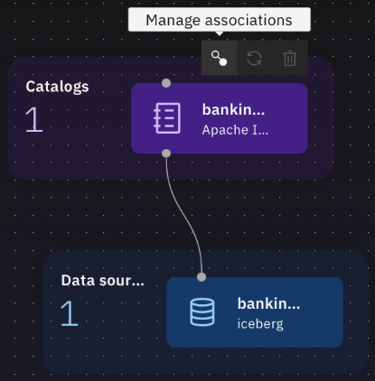

3. Select your active watsonx.data query engine, such as your Presto or Spark.

    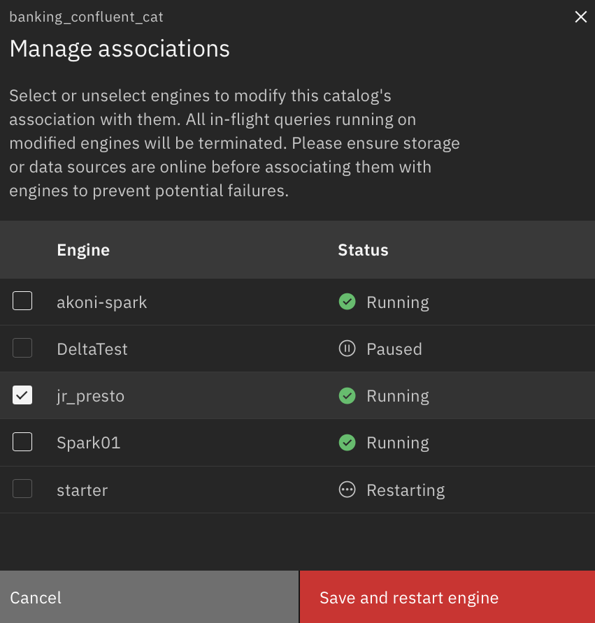

4. Confirm the association.

---

## Querying the Analytics Tables

1. Navigate to **Query workspace** in watsonx.data.
2. Select your Presto engine from the engine dropdown.
3. Run queries against your remote Tableflow tables:

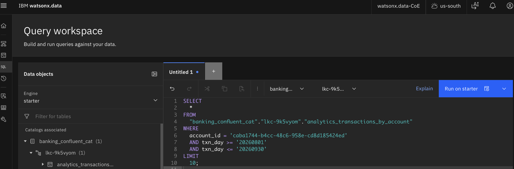

### Q1 — All transactions for an account in the last 30 days

```sql
SELECT *
FROM analytics_transactions_by_account
WHERE
  account_id = 'da88aee4-a69d-445c-b766-9b4910109241'
  AND txn_day >= '20260701'
  AND txn_day <= '20260731'
ORDER BY
  txn_timestamp DESC
```

### Q2 — Transactions > $10,000 in the last 60 minutes

```sql
SELECT *
FROM analytics_high_value_transaction_hourly
WHERE
  txn_time >= current_timestamp - interval '1' hour
  AND txn_time <= current_timestamp
```

### Q3 — Count of transactions > $50,000 by city in the last 24 hours

```sql
SELECT city, txn_count
FROM
  analytics_high_value_transaction_by_city
WHERE window_start >= current_timestamp - interval '24' hour
  AND window_start <= current_timestamp
-- option for arbitrary times
--  window_start >= timestamp '2026-07-01 00:09:00'
--  AND window_start < timestamp '2026-07-01 00:10:00'
```

### Q4 — Withdrawal transactions by manager (quarter)

```sql
-- First resolve the manager's direct reports from the employee cache,
-- then query each employee's partition
SELECT * FROM withdrawal_transaction_by_employee
WHERE employee_id = <emp_uuid>
  AND quarter = '2025Q1'
```

### Q5 - Customers with > 5 active accounts AND quarterly spend > $1,000,000

```sql
SELECT
  txn.customer_id,
  txn.quarter,
  txn.amount
FROM
  analytics_customer_quarterly_txn_total AS txn
  INNER JOIN analytics_customer_account_count AS acct ON txn.customer_id = acct.customer_id
WHERE
  acct.account_count > 5
  AND txn.amount >= 1000000
```

### Q6 - Daily branch totals for a date range

```sql
SELECT txn_date, total_amount, count_txn
FROM analytics_branch_daily_rollup
WHERE
  branch_id='16c92a43-cf71-47ba-bac6-b032315e647a'
  AND txn_date >= DATE '2026-07-25'
  AND txn_date <= DATE '2026-07-31'
ORDER BY txn_date DESC
```
