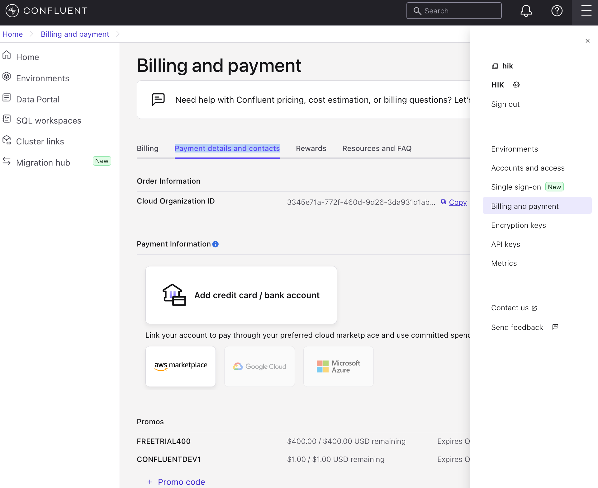
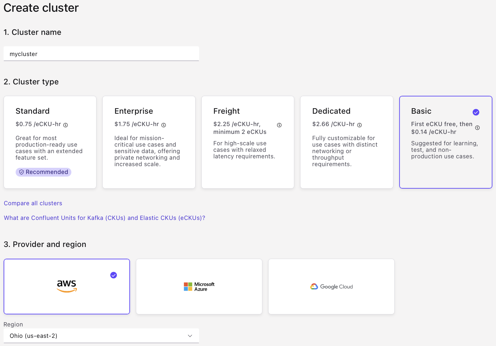
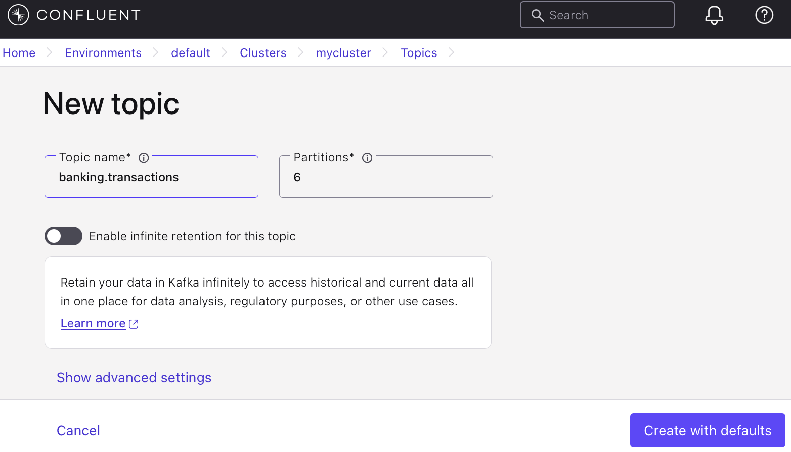
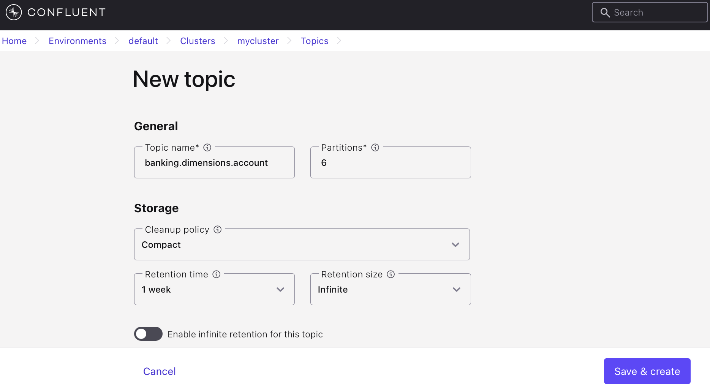
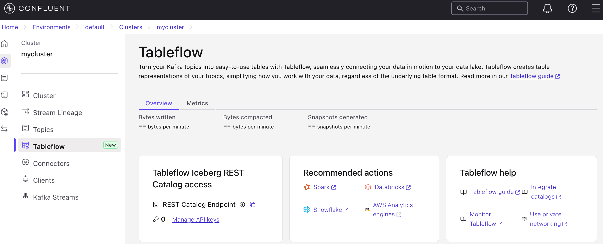
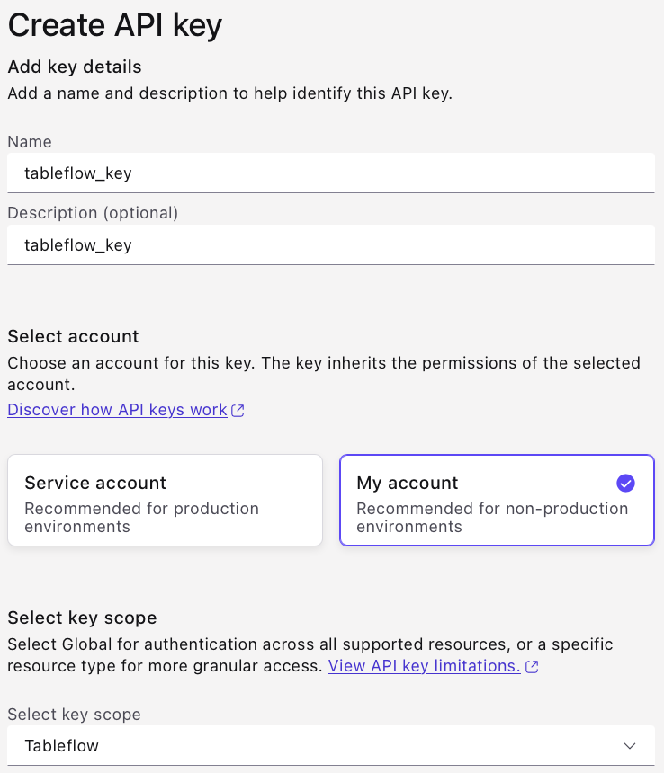

# Quick Start for Confluent Cloud

Confluent Cloud is a fully-managed, cloud-native data streaming platform powered by Apache Kafka.

Confluent Cloud has a web interface called the Cloud Console, a local command line interface, and REST APIs. Use the Cloud Console to manage cluster resources, settings, and billing. Use the Confluent CLI and REST APIs to create and manage topics and more.

This quick start gets you up and running with Confluent Cloud:

1. sign up for a free Confluent Cloud trial.
2. how to use Confluent Cloud to create topics, and produce and consume data to and from the cluster.
3. how to use Confluent Cloud for Apache Flink to run queries on the data using SQL syntax.

## 1 - Deploy a Free Cluster on Confluent Cloud

You will receive $400 free credit in your Confluent account. This credit expires after 30 days. Your free trial ends when you use all the credit or when the credit expires, whichever comes first.

### 1.1 - Sign Up for Confluent Cloud

1. Complete the signup process - [Signup](https://www.confluent.io/get-started/).
2. Do not immediately create a cluster, as we will bypass the credit card requirements with a special promo code.

### 1.2 - Register Special Promo Code

1. Bypass Payment Details
    - Navigate to **Billing and Payment**
    - Select the **Payment details and contacts** tab
    - Click on the **+ Promo Code** link at the bottom of the page
    - Enter the promo code **CONFLUENTDEV1**

## 2 - Create a cluster and add topics

### 2.1 - Create a Kafka cluster

1. Navigate to **Home**
2. Click Add cluster.
3. Select an environment to use: **default**
4. Configure the cluster:
    - Cluster name: **mycluster**
    - Cluster type: **Basic**
    - Provider and region: **AWS** - **Ohio (us-east-2)**
5. Click **Launch Cluster**

### 2.2 - Create Kafka topics

#### 2.2.1 - Transaction topic

1. Navigate to **Topics** in **Confluent Cloud Console**
2. Click **Create topic**.
    - Topic name: “banking.transactions”
3. Click **Create with defaults**.

#### 2.2.2 - Dimension topics

1. Add each of the following topics:
   - banking.dimensions.account
   - banking.dimensions.branch
   - banking.dimensions.customer
   - banking.dimensions.employee

  > **Note:** *In Advanced Settings, set the dimension topics to `cleanup.policy=compact` so Flink always has the latest value for each key.*

## 3 - REST API for Confluent Cloud

This API will be used by Python scripts to publish messages to Confluent.

### 3.1 - Find the endpoint address and cluster ID

1. Navigate to your cluster.
2. Select the **Overview** tab.
3. Note the **Bootstrap server**
4. Note the **cluster ID**.

### 3.2 - Create API key

1. Navigate to your cluster.
2. Select the **API keys** tab.
3. Click **Create key** and follow the prompts:
    - Select account: **My Account**
    - Description: as desired
4. Click **Download and continue**

### 3.3 - Update .env file

Copy the  following into your .env file:

  - **Bootstrap server** into `KAFKA_BOOTSTRAP_SERVERS`
  - **API key** into `KAFKA_API_KEY`
  - **API secret** into `KAFKA_API_SECRET`

## 4 - Schema Registry API for Confluent Cloud

This API will be used by Python scripts to register topic schemas.

### 4.1 - Find the Schema Registry endpoint address

1. Navigate to **Schema Registry** (in your Environment e.g. default).
2. Note the **Public endpoint**.

### 4.2 - Create API key

1. Click on **API keys**.
2. Click **Add API key** and follow the prompts:
    - Name: as desired
    - Description: as desired
    - Select account: **My Account**
    - Select Key Scope: **Schema Registry**
    - Enviornment: select your environment (**default**)
3. Click **Create API key**
4. Click **Download API key**

    

### 4.3 - Update .env file

Copy the  following into your .env file:

  - **Public endpoint** into `SCHEMA_REGISTRY_URL`
  - **API Key** into `SCHEMA_REGISTRY_API_KEY`
  - **API Secret** into `SCHEMA_REGISTRY_API_SECRET`

## 5 - Tableflow Iceberg API for Confluent CLoud

This API will be used by watsonx.data to look read data that resides in the Confluent Iceberg REST Catalog.

### 5.1 - Find the Tableflow endpoint address

1. Navigate to **Tableflow** in **Confluent Cloud Console** (in your Cluster e.g. mycluster).
2. Note the `Tableflow Iceberg REST Catalog` `REST Catalog Endpoint`

    

### 5.2 - Create API key

1. Generate a new API Key and Secret specifically for the Iceberg Catalog.
    - Click **Manage API keys**
    - Click **Add API key**
        - Name: `tableflow_key`
        - Select account: `My account`
        - Select key scope: `Tableflow`

          

### 5.3 - Update .env file

Copy the  following into your .env file:

  - **REST Catalog Endpoint** into `TABLEFLOW_ENDPOINT`
  - **API Key** into `TABLEFLOW_API_KEY`
  - **API Secret** into `TABLEFLOW_API_SECRET`
